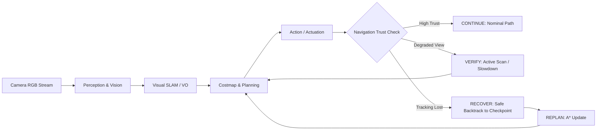
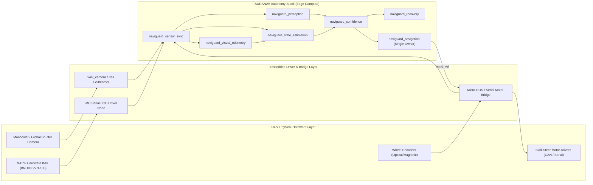

# AURANAV
### Vision-Based Autonomous Navigation for Outdoor UGV
**Smart India Hackathon (SIH) 2026 — Problem Statement SIH26126**  
**Organization:** Bharat Electronics Limited (BEL) | **Theme:** Smart Automation / Robotics | **Category:** Software  
**Team:** COMMBAT (Team ID: GAT026) — *AURA-Nav: Autonomous Uncertainty-Resilient Architecture for Ground Navigation*

[](https://docs.ros.org/en/jazzy/)
[](https://gazebosim.org/)
[](https://opencv.org/)
[](docs/NAVIGUARD_ORIGINAL_PERCEPTION_AND_SPATIAL_LAYER_ARCHITECTURE.md)
[](LICENSE)

---

```
  █████╗ ██╗   ██╗██████╗  █████╗ ███╗   ██╗ █████╗ ██╗   ██╗
 ██╔══██╗██║   ██║██╔══██╗██╔══██╗████╗  ██║██╔══██╗██║   ██║
 ███████║██║   ██║██████╔╝███████║██╔██╗ ██║███████║██║   ██║
 ██╔══██║██║   ██║██╔══██╗██╔══██║██║╚██╗██║██╔══██║╚██╗ ██╔╝
 ██║  ██║╚██████╔╝██║  ██║██║  ██║██║ ╚████║██║  ██║ ╚████╔╝ 
 ╚═╝  ╚═╝ ╚═════╝ ╚═╝  ╚═╝╚═╝  ╚═╝╚═╝  ╚═══╝╚═╝  ╚═╝  ╚═══╝  
```

**AURANAV** is an outdoor autonomous ground vehicle (UGV) navigation stack engineered for difficult, unstructured, and GPS-denied environments. Built on **ROS 2 Jazzy** and **Gazebo Harmonic**, AURANAV couples an exact physical vehicle footprint ($0.56\,\text{m} \times 0.48\,\text{m}$) with a physics-grounded **11-Layer Spatial Map Architecture**, a **YOLOv8 + Classical OpenCV Perception Fusion Engine**, and an **Autonomous Recovery State Machine**.

---

## 🎯 1. SIH 2026 Problem Statement & AURA-Nav Paradigm Shift

### Problem Statement Context (SIH26126 — Bharat Electronics Limited)
Outdoor Unmanned Ground Vehicles (UGVs) operating in military, tactical, or unstructured off-road scenarios suffer from unpredictable terrain (tall grass, mud, rock clusters), harsh illumination changes (direct glare, canopy shadows), and the absence of reliable GPS signals. Conventional navigation architectures fail because they operate on an unvalidated, blind assumption:

$$\text{Conventional UGV: } \mathbf{\text{"Can I navigate?"}} \implies \text{Blind continuation on unverified perception outputs}$$

### The AURA-Nav Paradigm Shift (`COMMBAT (2).pptx`)
AURANAV introduces a closed-loop **Navigation Trust Layer** that asks:

$$\mathbf{AURA\text{-}Nav: } \mathbf{\text{"Can I TRUST my navigation?"}} \implies \text{Continuous cross-validation of perception and localization}$$



---

## 📦 2. Complete Package-by-Package Technical Breakdown

The workspace comprises **11 modular ROS 2 packages**:

### 1. `naviguard_description`
* **Why it is used**: Defines the authentic physical, kinematic, visual, and collision footprint of the outdoor UGV.
* **What it does**: Provides URDF/XACRO models (`naviguard_gazebo.urdf.xacro`), defines physical coordinate frames, and integrates Gazebo Harmonic simulation plugins (skid-steer differential drive, camera sensor, IMU sensor).
* **Why it is better than others**: Avoids unrealistic dimensionless point-mass or generic box models. The geometry ($0.56\,\text{m} \times 0.48\,\text{m}$) is mathematically audited and centrally shared with planners, inflation filters, and web dashboards.
* **Algorithm / Model Used**: Rigid-body kinematic chain modeling, XACRO templating, and Gazebo Harmonic SDF sensor bridges.

### 2. `naviguard_sensor_sync`
* **Why it is used**: Outdoor visual navigation fails if camera frames, IMU measurements, and wheel odometry arrive with temporal skew or clock jitter.
* **What it does**: Synchronizes high-rate IMU ($100\,\text{Hz}$), wheel odometry ($50\,\text{Hz}$), and camera frames ($15\text{--}30\,\text{Hz}$). Computes real-time sensor health scores, jitter stats, and dropped-frame metrics.
* **Why it is better than others**: Standard ROS `ApproximateTimeSynchronizer` blindly drops messages when time deltas exceed a window and provides no telemetry. `naviguard_sensor_sync` logs jitter statistics and alerts the confidence layer before corrupted data reaches the EKF.
* **Algorithm / Model Used**: Sliding-window queue alignment, exponential moving average (EMA) jitter calculation, and Mahalanobis timestamp consistency gating.

### 3. `naviguard_visual_odometry`
* **Why it is used**: In GPS-denied outdoor environments, wheel slip on mud, sand, or wet grass corrupts dead-reckoning. Visual odometry provides an independent, slip-free motion reference.
* **What it does**: Tracks visual features between consecutive camera frames, computes optical flow displacement, and estimates relative 6-DoF camera rotation ($R$) and translation direction ($t$).
* **Why it is better than others**: Respects **monocular scale ambiguity** by explicitly treating translation scale as `UNKNOWN` (unit vector) rather than fabricating fake metric scale. Implements bidirectional optical flow validation to reject wind-blown grass and moving leaves.
* **Algorithm / Model Used**:
  - **Feature Detection**: Shi-Tomasi Good Features to Track (`cv2.goodFeaturesToTrack`).
  - **Feature Tracking**: Pyramidal Lucas-Kanade Optical Flow (`cv2.calcOpticalFlowPyrLK`) with bidirectional forward-backward error validation ($|p_{orig} - p_{back}| < \epsilon$).
  - **Pose Recovery**: 5-point/8-point Essential Matrix estimation with **RANSAC outlier rejection** (`cv2.findEssentialMat`) and cheirality verification (`cv2.recoverPose`).

### 4. `naviguard_state_estimation`
* **Why it is used**: Wheel odometry slips, IMU drifts over time, and monocular VO lacks metric scale. They must be fused into an optimal state estimate.
* **What it does**: Executes an onboard **Extended Kalman Filter (EKF)** estimating the 2D SE(2) robot state: $\mathbf{x} = [x, y, \theta, v_x, \omega_z]^T$.
* **Why it is better than others**:
  - Employs **Joseph-form covariance updates**:
    $$P = (I - KH)P(I - KH)^T + KRK^T$$
    guaranteeing positive semi-definiteness and numerical stability during sharp maneuvers.
  - Implements **Mahalanobis Distance Gating**:
    $$D_M^2 = (z - H\hat{x})^T (H P^- H^T + R)^{-1} (z - H\hat{x})$$
    rejecting measurements exceeding $3\sigma$ ($9.0$ for 1-DoF, $13.8$ for 2-DoF) before they corrupt the filter.
* **Algorithm / Model Used**: Discrete-time Non-linear Extended Kalman Filter (EKF), Runge-Kutta 2nd-order kinematic propagation, Joseph-form covariance stabilization, Mahalanobis gating.

### 5. `naviguard_slam`
* **Why it is used**: Builds a persistent 2D metric occupancy map and corrects accumulated dead-reckoning drift through loop closures over extended runs.
* **What it does**: Manages keyframe databases, detects visual loop closures, performs pose graph optimization, and maintains a 2D log-odds occupancy grid map ($0.05\,\text{m}$ resolution).
* **Why it is better than others**: Indoor 2D LiDAR SLAM fails in open outdoor fields. `naviguard_slam` couples keyframe visual place recognition with robust non-linear pose graph optimization.
* **Algorithm / Model Used**:
  - **Pose Graph Optimization (PGO)**: Non-linear least-squares optimization over SE(2) relative pose constraints using SciPy's `least_squares` with **Huber loss** to reject outlier loop closures.
  - **Place Recognition**: Appearance-based image feature similarity matching.
  - **Grid Mapping**: Bresenham ray casting with Bayesian log-odds occupancy updates.

### 6. `naviguard_perception`
* **Why it is used**: Detects obstacles, negative obstacles (ditches), terrain boundaries, and traversable pathways directly from RGB camera images.
* **What it does**:
  - Runs **YOLOv8** via OpenCV DNN for discrete outdoor objects (`person`, `vehicle`, `tree`, `rock`, `log`, `barrier`, `pole`, `mud`, `bush`).
  - Performs **Classical OpenCV Traversability Segmentation** using HSV color ranges and Sobel gradient variance to separate dirt trails from rough terrain.
  - Houses the **Perception Fusion Engine**: projects image detections into 2D map space via inverse planar homography ($u, v \rightarrow x, y$) and performs multi-frame temporal obstacle tracking.
* **Why it is better than others**: Single-frame neural nets cause phantom braking on sun glints or floating leaves. `naviguard_perception` requires **$\ge 3$ consecutive frames** of persistence before adding obstacles to the costmap, with a **near-field emergency bypass** ($<1.0\,\text{m}$, confidence $>0.70$) for immediate collision avoidance.
* **Algorithm / Model Used**: YOLOv8 (ONNX via `cv2.dnn`), HSV thresholding + Sobel texture variance, Inverse Perspective Mapping (IPM) homography, multi-frame persistence & decay tracking.

### 7. `naviguard_confidence`
* **Why it is used**: **The core novelty of the BEL SIH challenge** — continuously audits system health and autonomy validity.
* **What it does**: Tracks 4 core confidence dimensions:
  1. *Perception Confidence* (feature richness, illumination adequacy, glare index, detection scores).
  2. *Localization Quality* (EKF innovation covariance, VO inlier ratio).
  3. *Motion Consistency* (wheel speed vs. visual optical flow agreement).
  4. *Sensor Sync Health* (jitter, latency, packet drop rate).
  Evaluates the tri-state autonomy FSM (`CONTINUE`, `VERIFY`, `RECOVER`).
* **Why it is better than others**: Nav2 and move_base assume sensors are always valid. When vision degrades, standard stacks drive blindly into obstacles. `naviguard_confidence` intercepts degraded autonomy before collisions occur.
* **Algorithm / Model Used**: Multi-criteria weighted Bayesian confidence scoring, threshold hysteresis, and deterministic tri-state autonomy FSM.

### 8. `naviguard_recovery`
* **Why it is used**: Recovers the UGV safely when visual tracking degrades, corridors are blocked, or confidence drops below operating thresholds.
* **What it does**:
  - Implements a **10-State Recovery Finite State Machine** (`NORMAL`, `VERIFY`, `SAFE_STOP`, `SELECT_CHECKPOINT`, `RECOVER`, `RELOCALIZE`, `VERIFY_RECOVERY`, `REPLAN`, `RESUME`, `FAILED_SAFE`).
  - Maintains a circular buffer of **Verified Trusted States**: historical poses with verified high visual texture and clearance.
  - Conducts active visual reacquisition: controlled in-place rotation scans and stationary feature settlement dwells.
  - Enforces a **bounded recovery budget** (max attempts and time limits) to prevent infinite recovery loops.
* **Why it is better than others**: Standard Nav2 recovery behaviors (spin, backup, clear costmap) operate blindly and often back into unmapped hazards. NAVIGUARD backtracks strictly along its *known safe historical trajectory* to a verified checkpoint.
* **Algorithm / Model Used**: Bounded Recovery FSM, candidate checkpoint scoring function, active visual rotation profile, trajectory rollback interpolation.

### 9. `naviguard_navigation`
* **Why it is used**: Global path synthesis and local path following with strict single ownership of vehicle actuation.
* **What it does**:
  - Implements an **8-connected A* Global Planner** with multi-factor costs (Euclidean distance, terrain roughness, corridor narrowness penalty, turn feasibility).
  - Implements an adaptive **Pure Pursuit Controller** dynamically modulating speed based on corridor width, path curvature, and confidence.
  - Evaluates continuous **Swept Footprint Collision Checking** using Oriented Bounding Boxes (OBB).
  - Serves as the **sole publisher to `/cmd_vel`** across the entire stack.
* **Why it is better than others**: Evaluates rectangular swept footprints ($0.56\,\text{m} \times 0.48\,\text{m}$) and requires a minimum turning space ($\ge 0.94\,\text{m}$) for turns $>35^\circ$. Hard-rejects corridors $<0.58\,\text{m}$ with `INSUFFICIENT_CLEARANCE`.
* **Algorithm / Model Used**: Multi-cost A* Graph Search with Euclidean heuristic, Pure Pursuit tracking with dynamic lookahead ($L_d = 0.40\,\text{m}$), Separating Axis Theorem (SAT) / OBB sweep polygon intersection testing.

### 10. `naviguard_dashboard`
* **Why it is used**: Remote ground control, live multi-spectral video streams, 2D map HUD, telemetry auditing, and goal dispatching.
* **What it does**:
  - Hosts a lightweight HTTP server (`web_server.py`) at `http://localhost:8080`.
  - Streams real-time MJPEG video feeds (`raw`, `yolo`, `segmentation`, `unified`, `vo`, `chase`, `panorama`).
  - Serves REST APIs for telemetry, coordinate conversions, goal safety validation, and fault injection.
  - Delivers the single-page cyber tactical operator interface (`index.html`).
* **Why it is better than others**: Eliminates heavy WebSockets, ROSBridge suites, or Node.js runtimes. Built with Python standard library `ThreadingHTTPServer` with zero extra server dependencies, non-blocking socket handling, and bounded latest-frame buffers (size=1) that never crash from `BrokenPipeError`.
* **Algorithm / Model Used**: Multi-client bounded buffer MJPEG streaming, canvas-to-world coordinate transformations, client-side 2D vector rendering.

### 11. `naviguard_rellis`
* **Why it is used**: Benchmarking and evaluating the autonomous stack against the real-world **RELLIS-3D** multimodal off-road dataset.
* **What it does**:
  - Loads off-road camera sequences, point clouds, calibrations, and semantic labels.
  - Replays timestamp-synchronized image streams into the perception pipeline.
  - Houses the **Ground Truth Guard** to ensure ground-truth data is isolated strictly to benchmarking and never leaked into navigation nodes.
* **Why it is better than others**: Provides verified quantitative validation of perception, traversability, and SLAM accuracy against ground-truth outdoor trails before physical hardware deployment.
* **Algorithm / Model Used**: Kitti/RELLIS format parser, ROS 2 clock replay publisher, trajectory RMSE / APE (Absolute Pose Error) calculation.

---

## 🧭 3. 11-Layer Spatial Map Architecture & Technical Stack

```
+---------------------------------------------------------------------------------------------------+
| L11: Operator HUD & Overlays     | Real-time waypoints, vehicle OBB polygon, status badges         |
+----------------------------------+----------------------------------------------------------------+
| L10: Swept Footprint Trajectory  | Continuous OBB volume verification between waypoints           |
+----------------------------------+----------------------------------------------------------------+
| L9:  Corridor Feasibility        | SAFE (>=0.68m), TIGHT (0.58-0.68m), BLOCKED (<0.58m), Turn>=0.94m |
+----------------------------------+----------------------------------------------------------------+
| L8:  Dynamic Hazard Zone         | Near-field emergency triggers (<1.0m, >0.70 confidence)        |
+----------------------------------+----------------------------------------------------------------+
| L7:  Geometry Inflation          | Lethal zone (0.34m) with quadratic decay up to 1.0m            |
+----------------------------------+----------------------------------------------------------------+
| L6:  Terrain Cost Model          | Slope gradients, gravel, grass, soil roughness penalties       |
+----------------------------------+----------------------------------------------------------------+
| L5:  Temporal Perception Fusion  | Persistent obstacles (>=3 hits confirmed, decay on miss)       |
+----------------------------------+----------------------------------------------------------------+
| L4:  Vehicle Occupancy Grid      | 2D metric grid SLAM (0.05m cell resolution)                    |
+----------------------------------+----------------------------------------------------------------+
| L3:  Traversability Segmentation | HSV trail/vegetation separation + YOLOv8 bounding boxes       |
+----------------------------------+----------------------------------------------------------------+
| L2:  Filtered Sensory Points     | Ground-plane filtered points, inverse homography projections   |
+----------------------------------+----------------------------------------------------------------+
| L1:  Raw Sensor Streams          | Monocular RGB camera, 9-DOF IMU, wheel encoder ticks           |
+---------------------------------------------------------------------------------------------------+
```

### Physical Vehicle Geometry Derivation
Audited directly from the vehicle URDF:
* **Chassis Dimensions**: $0.50\,\text{m} \text{ (Length)} \times 0.32\,\text{m} \text{ (Width)} \times 0.16\,\text{m} \text{ (Height)}$
* **Bumper Outer Extremes**: $x = \pm 0.28\,\text{m} \implies$ **Total Length = $0.56\,\text{m}$**
* **Wheel Outer Lateral Edges**: $y = \pm 0.24\,\text{m} \implies$ **Total Width = $0.48\,\text{m}$**
* **Wheelbase**: $0.30\,\text{m}$ | **Track Width**: $0.42\,\text{m}$ | **Wheel Radius**: $0.08\,\text{m}$
* **Inscribed Radius ($R_{\text{inscribed}}$)**: $\frac{\text{Total Width}}{2} = 0.24\,\text{m}$
* **Circumscribed Radius ($R_{\text{circumscribed}}$)**: $\sqrt{0.28^2 + 0.24^2} \approx 0.3688\,\text{m}$
* **Inflation Radius ($R_{\text{inflate}}$)**: $R_{\text{inscribed}} + M_{\text{safety}} = 0.24\,\text{m} + 0.10\,\text{m} = \mathbf{0.34\,\text{m}}$
* **Quadratic Proximity Cost Decay ($0.34\,\text{m} < d \le 1.0\,\text{m}$)**:
  $$C(d) = 100 \cdot \left(1 - \frac{d - 0.34}{1.0 - 0.34}\right)^2$$
* **Skid-Steer Turning Envelope**: Poses requiring $>35^\circ$ heading changes require:
  $$\text{Turn Space} \ge 2 \times (R_{\text{circumscribed}} + M_{\text{safety}}) \approx \mathbf{0.94\,\text{m}}$$

### Technical Stack

| Layer / Domain | Technology | Implementation Details |
|:---|:---|:---|
| **OS** | Ubuntu 24.04 LTS (Noble) / WSL2 | 64-bit Linux execution environment |
| **Middleware** | **ROS 2 Jazzy Jalisco** | Inter-node IPC, DDS transport, TF2 coordinate transforms |
| **Simulation** | **Gazebo Harmonic (Gz-Sim 8)** | High-fidelity physics, sensor SDF plugins, differential drive |
| **AI Perception** | **YOLOv8** (`cv2.dnn` ONNX) | Real-time object detection (CPU-optimized, honest telemetry) |
| **Computer Vision** | **OpenCV 4.x (`cv2`)** | Lucas-Kanade optical flow, Essential Matrix, HSV traversability |
| **Sensor Fusion** | **Joseph-form EKF** | Fuses VO + IMU + Wheel Odom with Mahalanobis outlier gating |
| **Optimization** | **SciPy (`least_squares`)** | Huber-loss Pose Graph Optimization for SE(2) SLAM |
| **Web Server** | Python `ThreadingHTTPServer` | Standard library, zero-dependency REST & MJPEG stream server |
| **Web Frontend** | **Vanilla HTML5 + CSS3 + JS** | Canvas 2D map HUD, real-time telemetry polling, goal dispatch |
| **Build & Test** | `colcon` + `pytest` | **244 automated unit/integration tests** passing (100% pass) |

---

## ⚡ 4. Quick Start & Kali-Style Launcher

AURANAV includes an interactive, Kali-style cyber terminal launcher:

```bash
# Clone the repository
git clone git@github.com:codinghubindia/auranav.git
cd auranav

# Install Python dependencies (creates .venv preserving ROS 2 Jazzy links)
./install_python_deps.sh
# Or audit installed packages:
./install_python_deps.sh --check

# Run the interactive Kali-style launcher
./run_auranav.sh
```

### Launcher CLI Flags:
```bash
./run_auranav.sh                  # Interactive menu & live control console
./run_auranav.sh --gui            # Launch with Gazebo Harmonic 3D desktop GUI
./run_auranav.sh --headless       # Fast headless simulation for WSL2/Linux
./run_auranav.sh --rviz           # Launch RViz2 alongside operator dashboard
./run_auranav.sh --build          # Clean workspace build with colcon before launch
./run_auranav.sh --deps           # Audit Python dependencies against requirements.txt
./run_auranav.sh --verbose        # Stream raw ROS 2 launch logs to terminal
```

### Interactive Control Console Commands:
While the stack is running, the terminal provides a live interactive shell:
```
┌──(auranav㉿ugv)-[~/auranav]
└─$ [command]
```
- `s`, `status`: Live vehicle pose, corridor clearance, active detections, and subsystem health.
- `g`, `geometry`: Audited physical dimensions, wheel track, inflation radii, and turn space.
- `y`, `yolo`: YOLOv8 detector telemetry (device, latency, detected classes).
- `d`, `dashboard`: Open or display Operator Web Dashboard URL (`http://localhost:8080`).
- `goal <x> <y>`: Dispatch autonomous navigation goal coordinates.
- `l`, `logs`: Tail the live launch log in real time.
- `c`, `clear`: Redraw Kali banner and status.
- `q`, `quit`: Cleanly shut down all ROS nodes and Gazebo.

---

## 🤖 5. Real-World Deployment, Hardware & Actuation Pipeline



### 5.1 Real-World Data Ingestion & Actuation Flow
1. **Sensor Ingestion**:
   - **Camera**: USB3 / MIPI-CSI camera streams raw frames using `v4l2_camera` or GStreamer to `/camera/image_raw` (`sensor_msgs/msg/Image`).
   - **IMU**: 9-DoF IMU transmits linear acceleration and angular velocity over UART/I2C to `/imu/data` (`sensor_msgs/msg/Imu`).
   - **Wheel Encoders**: Microcontroller (STM32 / Teensy running micro-ROS) streams measured wheel odometry ticks to `/odom` (`nav_msgs/msg/Odometry`).
   - **Autonomous Integrity**: No privileged ground-truth state is used. Odometry is derived solely from the visual-inertial EKF.
2. **Strict Single `/cmd_vel` Ownership**:
   - Only `NavigationNode` (`naviguard_navigation`) is permitted to publish to `/cmd_vel` (`geometry_msgs/msg/Twist`).
   - The web dashboard and recovery nodes never publish to `/cmd_vel` directly. When recovery is needed, control is handed off deterministically via state flags.
   - Motor drivers (Roboteq, Sabertooth, VESC) receive `/cmd_vel` ($20\,\text{Hz}$) over CAN/Serial and compute skid-steer differential velocities:
     $$v_L = v_x - \frac{\omega_z \cdot B}{2}, \quad v_R = v_x + \frac{\omega_z \cdot B}{2}$$
     where $B = 0.42\,\text{m}$ is the vehicle track width.

### 5.2 Recommended Hardware Specification
* **Edge Compute**: NVIDIA Jetson Orin Nano / Orin NX (8GB/16GB) or Fanless Rugged PC (Intel i7, 16GB RAM).
* **Sensors**: Monocular Global Shutter Camera (e-con Systems / Luxonis OAK-1 / RealSense D435i in RGB mode), Bosch BNO085 9-DoF IMU, high-resolution optical/magnetic wheel encoders ($\ge 1024$ PPR).
* **Platform**: 4WD skid-steer all-terrain outdoor chassis matching the $0.56\,\text{m} \times 0.48\,\text{m}$ footprint.

---

## 🌐 6. Web Streaming & Ground Control Station

Hosted locally at **`http://localhost:8080`**:

### Architecture Highlights:
* **Server Framework**: Pure Python standard library `http.server.ThreadingHTTPServer`. Zero external dependencies (no Flask, FastAPI, Django, or ROSBridge suites).
* **Streaming Protocol**: Multipart HTTP MJPEG (`multipart/x-mixed-replace; boundary=frame`) streamed over `/api/stream?type=<type>`.
* **Bounded Buffer Policy**: Frame buffers have **$\text{capacity} = 1$**. Stale frames are dropped immediately if unread, guaranteeing zero latency lag over field radio links.
* **Non-Blocking Sockets**: `_safe_write()` cleanly handles client disconnects (`BrokenPipeError`, `ConnectionResetError`) without thread crashes.
* **Multi-Spectral Video Streams**:
  - `/api/stream?type=raw` ($15\,\text{FPS}$) — Raw camera sensor view.
  - `/api/stream?type=yolo` ($10\,\text{FPS}$) — YOLOv8 bounding boxes, labels, and confidences.
  - `/api/stream?type=segmentation` ($10\,\text{FPS}$) — Classical traversability mask.
  - `/api/stream?type=unified` ($10\,\text{FPS}$) — Blended traversability + obstacle overlay.
  - `/api/stream?type=vo` ($10\,\text{FPS}$) — Optical flow vectors and tracked features.
  - `/api/stream?type=panorama` ($15\,\text{FPS}$) — Reconstructed wide-angle visual scan.
  - `/api/stream?type=chase` ($15\,\text{FPS}$) — Third-person chase camera view.
* **Interactive HTML5 Canvas HUD**:
  - Live occupancy grid, vehicle bounding box polygon, and goal vectors.
  - Interactive click-to-validate and click-to-dispatch goal coordinates with real-time clearance safety checks.
  - Expandable **11-Layer Architecture Legend** and **Physical Geometry Telemetry Card**.

---

## 🧪 7. Test Suite & Verification

The repository includes a comprehensive regression test suite with **244 passing tests**:

```bash
source /opt/ros/jazzy/setup.bash
source install/setup.bash
colcon test --event-handlers console_direct+
```

| Package | Test Count | Status | Description |
|:---|:---:|:---:|:---|
| `naviguard_navigation` | 52 | **PASSED** | A* planner, pure pursuit, swept footprint, corridor clearance |
| `naviguard_dashboard` | 36 | **PASSED** | Web server, goal validation, coordinate conversion, state cache |
| `naviguard_rellis` | 28 | **PASSED** | RELLIS-3D dataset replay, ground truth isolation, evaluator |
| `naviguard_confidence` | 20 | **PASSED** | Multi-dimensional confidence scoring, tri-state decision FSM |
| `naviguard_state_estimation` | 20 | **PASSED** | EKF state model, Joseph-form update, Mahalanobis gating |
| `naviguard_recovery` | 19 | **PASSED** | 10-state recovery FSM, trusted state rollback, rotation scan |
| `naviguard_sensor_sync` | 19 | **PASSED** | Timestamp alignment, jitter calculation, frame validation |
| `naviguard_perception` | 17 | **PASSED** | YOLOv8 detector, HSV segmentation, IPM projection, persistence filter |
| `naviguard_slam` | 17 | **PASSED** | Keyframe manager, Huber-loss pose graph optimization, occupancy grid |
| `naviguard_visual_odometry` | 16 | **PASSED** | Lucas-Kanade optical flow, Essential matrix, RANSAC outlier filter |
| **Total** | **244** | **100% PASS** | Zero failures, zero warnings |

---

## 📚 8. Technical Documentation Links

- [`docs/NAVIGUARD_ORIGINAL_PERCEPTION_AND_SPATIAL_LAYER_ARCHITECTURE.md`](docs/NAVIGUARD_ORIGINAL_PERCEPTION_AND_SPATIAL_LAYER_ARCHITECTURE.md): Full 17-section system design document.
- [`docs/NAVIGUARD_YOLO_FOOTPRINT_AND_LAYER_INTEGRATION_REPORT.md`](docs/NAVIGUARD_YOLO_FOOTPRINT_AND_LAYER_INTEGRATION_REPORT.md): 27-point architectural integration report.
- [`docs/PERFORMANCE_DIFFICULT_TERRAIN_AND_FAILURE_RELIABILITY_REPORT.md`](docs/PERFORMANCE_DIFFICULT_TERRAIN_AND_FAILURE_RELIABILITY_REPORT.md): Outdoor off-road reliability analysis.
- [`docs/FINAL_RELLIS_DASHBOARD_RECOVERY_INTEGRATION_REPORT.md`](docs/FINAL_RELLIS_DASHBOARD_RECOVERY_INTEGRATION_REPORT.md): Comprehensive RELLIS-3D and Ground Control Station report.

---
*Developed by Team COMMBAT (Team ID: GAT026) for the Smart India Hackathon (SIH) 2026 — Problem Statement SIH26126 (Bharat Electronics Limited).*
