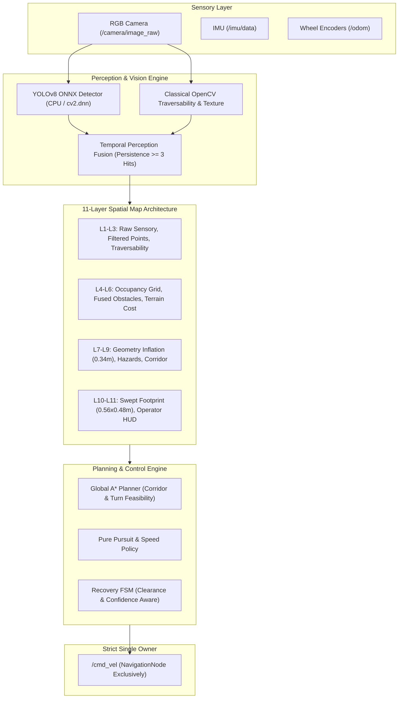

# NAVIGUARD
### Vision-Based Autonomous Navigation for Outdoor UGV
**Smart India Hackathon (SIH) 2026 — Problem Statement 26126**

[](https://docs.ros.org/en/jazzy/)
[](https://gazebosim.org/)
[](https://opencv.org/)
[](docs/NAVIGUARD_ORIGINAL_PERCEPTION_AND_SPATIAL_LAYER_ARCHITECTURE.md)
[](LICENSE)

---

```
 ███╗   ██╗ █████╗ ██╗   ██╗██╗ ██████╗ ██╗   ██╗ █████╗ ██████╗ ██████╗ 
 ████╗  ██║██╔══██╗██║   ██║██║██╔════╝ ██║   ██║██╔══██╗██╔══██╗██╔══██╗
 ██╔██╗ ██║███████║██║   ██║██║██║  ███╗██║   ██║███████║██████╔╝██║  ██║
 ██║╚██╗██║██╔══██║╚██╗ ██╔╝██║██║   ██║██║   ██║██╔══██║██╔══██╗██║  ██║
 ██║ ╚████║██║  ██║ ╚████╔╝ ██║╚██████╔╝╚██████╔╝██║  ██║██║  ██║██████╔╝
 ╚═╝  ╚═══╝╚═╝  ╚═╝  ╚═══╝  ╚═╝ ╚═════╝  ╚═════╝ ╚═╝  ╚═╝╚═╝  ╚═╝╚═════╝ 
```

**NAVIGUARD** is an outdoor autonomous ground vehicle (UGV) navigation stack engineered for difficult, unstructured, and GPS-denied environments. Built on **ROS 2 Jazzy** and **Gazebo Harmonic**, NAVIGUARD couples an exact physical vehicle footprint ($0.56\,\text{m} \times 0.48\,\text{m}$) with a physics-grounded **11-Layer Spatial Map Architecture**, a **YOLOv8 + Classical OpenCV Perception Fusion Engine**, and an **Autonomous Recovery State Machine**.

---

## ⚡ Quick Start & Kali-Style Interactive Launcher

NAVIGUARD features a unified, interactive terminal launcher with a Kali-style cyber console:

```bash
# Clone the repository
git clone git@github.com:codinghubindia/auraguard.git
cd auraguard

# Install Python dependencies (creates .venv preserving ROS 2 Jazzy links)
./install_python_deps.sh
# Or audit installed packages:
./install_python_deps.sh --check

# Run the interactive Kali-style launcher
./run_naviguard.sh
```

### Launcher CLI Options:
```bash
./run_naviguard.sh                  # Interactive menu & live control console
./run_naviguard.sh --gui            # Launch with Gazebo Harmonic 3D desktop GUI
./run_naviguard.sh --headless       # Fast headless simulation for WSL2/Linux
./run_naviguard.sh --rviz           # Launch RViz2 alongside operator dashboard
./run_naviguard.sh --build          # Clean workspace build with colcon before launch
./run_naviguard.sh --deps           # Audit Python dependencies against requirements.txt
./run_naviguard.sh --verbose        # Stream raw ROS 2 launch logs to terminal
```

### Interactive Control Shell Commands:
While the stack is running, the terminal provides a live interactive shell:
```
┌──(naviguard㉿ugv)-[~/autonomous-stack]
└─$ [command]
```
- `s`, `status`: Live vehicle pose, corridor clearance, active detections, and subsystem health.
- `g`, `geometry`: Audited physical dimensions, wheel track, inflation radii, and turn space.
- `y`, `yolo`: YOLOv8 detector telemetry (device, latency, detected classes).
- `d`, `dashboard`: Open or display Operator Web Dashboard URL (`http://localhost:8080`).
- `goal <x> <y>`: Dispatch autonomous navigation goal coordinates.
- `l`, `logs`: Tail the live launch log in real time.
- `c`, `clear`: Redraw Kali banner and status.
- `q`, `quit`: Cleanly shut down all ROS nodes and Gazebo.

---

## 🧭 System Architecture



---

## 📐 Physical Vehicle Geometry

Derived from exact URDF/XACRO model audit:
- **Chassis Dimensions**: $0.50\,\text{m} \text{ (Length)} \times 0.32\,\text{m} \text{ (Width)} \times 0.16\,\text{m} \text{ (Height)}$
- **Bumper Outer Extremes**: $x = \pm 0.28\,\text{m} \implies$ **Total Length = $0.56\,\text{m}$**
- **Wheel Outer Lateral Edges**: $y = \pm 0.24\,\text{m} \implies$ **Total Width = $0.48\,\text{m}$**
- **Wheelbase**: $0.30\,\text{m}$ | **Track Width**: $0.42\,\text{m}$
- **Inscribed Radius ($R_{\text{inscribed}}$)**: $0.24\,\text{m}$
- **Circumscribed Radius ($R_{\text{circumscribed}}$)**: $\sqrt{0.28^2 + 0.24^2} \approx 0.3688\,\text{m}$
- **Inflation Radius ($R_{\text{inflate}}$)**: $R_{\text{inscribed}} + 0.10\,\text{m} = 0.34\,\text{m}$
- **Skid-Steer Turning Space**: $\ge 0.94\,\text{m}$ (required for turns $>35^\circ$)
- **Corridor Passage Criteria**:
  - `SAFE`: Width $\ge 0.68\,\text{m}$ (Nominal navigation)
  - `TIGHT`: $0.58\,\text{m} \le \text{Width} < 0.68\,\text{m}$ (Speed reduced, $+35.0$ penalty)
  - `BLOCKED`: $\text{Width} < 0.58\,\text{m}$ (Hard rejection, `INSUFFICIENT_CLEARANCE`)

---

## 👁️ 11-Layer Spatial Map Model

| Layer | Name | Description |
|:---:|:---|:---|
| **L11** | Operator HUD & Overlays | Goal vectors, vehicle OBB polygon, status badges |
| **L10** | Swept Footprint Trajectory | Continuous swept polygon collision checks |
| **L9** | Corridor Feasibility | Passability classification (`SAFE`, `TIGHT`, `BLOCKED`) |
| **L8** | Dynamic Hazard Zone | Near-field emergency triggers ($<1.0\,\text{m}$) |
| **L7** | Geometry Inflation | $0.34\,\text{m}$ lethal zone with quadratic proximity decay to $1.0\,\text{m}$ |
| **L6** | Terrain Cost Model | Slope, soil, gravel, texture variance penalties |
| **L5** | Temporal Perception Fusion | Multi-frame tracked obstacles ($\ge 3$ hits to confirm) |
| **L4** | Vehicle Occupancy Grid | 2D metric grid SLAM ($0.05\,\text{m}$ resolution) |
| **L3** | Traversability Segmentation | OpenCV HSV color + edge variance analysis |
| **L2** | Filtered Sensory Points | Ground-plane separated point clouds |
| **L1** | Raw Sensor Streams | Monocular camera, IMU acceleration, wheel ticks |

---

## 🖥️ Operator Web Dashboard

The web dashboard is hosted locally at **`http://localhost:8080`** and provides:
- **Interactive 2D Map HUD**: Live occupancy grid, vehicle bounding box, and waypoints.
- **11-Layer Specification Legend**: Expandable visual reference of the spatial pipeline.
- **Vehicle Geometry Card**: Live clearance telemetry, corridor width, and `CAN FIT` / `CAN TURN` status.
- **YOLOv8 Detection Stream**: Real-time object detection stream with honest hardware reporting (`CPU`).
- **Autonomous Goal Dispatch**: Click-to-dispatch navigation targets with validation.

---

## 🧪 Test Suite & Verification

The repository includes a comprehensive regression test suite with **244 passing tests**:

```bash
source /opt/ros/jazzy/setup.bash
source install/setup.bash
colcon test --event-handlers console_direct+
```

| Package | Test Count | Status |
|:---|:---:|:---:|
| `naviguard_navigation` | 52 | **PASSED** |
| `naviguard_dashboard` | 36 | **PASSED** |
| `naviguard_rellis` | 28 | **PASSED** |
| `naviguard_confidence` | 20 | **PASSED** |
| `naviguard_state_estimation` | 20 | **PASSED** |
| `naviguard_recovery` | 19 | **PASSED** |
| `naviguard_sensor_sync` | 19 | **PASSED** |
| `naviguard_perception` | 17 | **PASSED** |
| `naviguard_slam` | 17 | **PASSED** |
| `naviguard_visual_odometry` | 16 | **PASSED** |
| **Total** | **244** | **100% PASS** |

---

## 📚 Technical Documentation

- [`docs/NAVIGUARD_ORIGINAL_PERCEPTION_AND_SPATIAL_LAYER_ARCHITECTURE.md`](docs/NAVIGUARD_ORIGINAL_PERCEPTION_AND_SPATIAL_LAYER_ARCHITECTURE.md): Full 17-section system specification.
- [`docs/NAVIGUARD_YOLO_FOOTPRINT_AND_LAYER_INTEGRATION_REPORT.md`](docs/NAVIGUARD_YOLO_FOOTPRINT_AND_LAYER_INTEGRATION_REPORT.md): 27-point architectural integration report.
