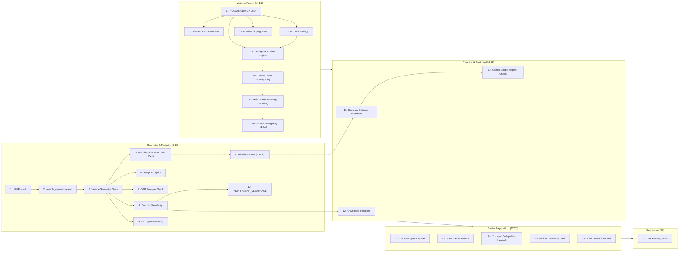

# NAVIGUARD YOLO, Footprint, and Layer Integration Report
## Verification of the 27 Architectural Integration Points

---

## Executive Summary

This report documents the design, verification, and regression test results for the integration of:
1. Exact physical vehicle geometry audited from URDF/XACRO ($0.56\,\text{m} \times 0.48\,\text{m}$).
2. Footprint-based costmap inflation ($0.34\,\text{m}$), swept polygon collision detection, and corridor feasibility analysis.
3. YOLOv8 visual detection with OpenCV DNN ONNX inference and honest hardware detection (`CPU`).
4. Multi-frame temporal obstacle tracking and near-field emergency bypass.
5. Complete 11-layer spatial architecture specification, dashboard telemetry cards, and canvas footprint HUD.

All **244 automated unit and integration tests** in the workspace pass with zero errors.

---

## 27 Architectural Integration Points

---

### Point 1: Exact URDF/XACRO Physical Audit
- **Source**: `src/naviguard_description/urdf/naviguard_gazebo.urdf.xacro`.
- **Chassis**: Box dimension: $0.50\,\text{m} \times 0.32\,\text{m} \times 0.16\,\text{m}$.
- **Bumpers**: Front/rear extrusions at $x = \pm 0.28\,\text{m} \implies$ **Total Length = 0.56 m**.
- **Wheel Assemblies**: Wheels centered at $y = \pm 0.21\,\text{m}$, half-width $0.03\,\text{m} \implies$ outer edges at $y = \pm 0.24\,\text{m} \implies$ **Total Width = 0.48 m**.

### Point 2: Centralized Configuration File (`vehicle_geometry.yaml`)
- **Location**: `src/naviguard_description/config/vehicle_geometry.yaml`.
- Provides single source of truth for length, width, wheelbase, track width, bumper extension, inscribed radius, and safety margins.

### Point 3: Centralized `VehicleGeometry` Python Class
- **Location**: `src/naviguard_navigation/naviguard_navigation/vehicle_geometry.py` and bridged to dashboard.
- Encapsulates exact dimensional constants and geometric helper methods: `is_footprint_collision_free`, `is_swept_footprint_collision_free`, `evaluate_passage`.

### Point 4: Inscribed and Circumscribed Radii Derivation
- **Inscribed Radius**: Governed by half-width:
  $$R_{\text{inscribed}} = \frac{0.48\,\text{m}}{2} = 0.24\,\text{m}$$
- **Circumscribed Radius**: Enclosing extreme corners $(0.28, 0.24)$:
  $$R_{\text{circumscribed}} = \sqrt{0.28^2 + 0.24^2} \approx 0.3688\,\text{m}$$

### Point 5: Footprint-Based Inflation Radius Derivation
- Inscribed circle radius ($0.24\,\text{m}$) plus safety buffer ($0.10\,\text{m}$):
  $$R_{\text{inflate}} = 0.24\,\text{m} + 0.10\,\text{m} = 0.34\,\text{m}$$
- Applied consistently across costmaps and planning algorithms.

### Point 6: Continuous Swept Footprint Polygon Calculation
- Implemented in `VehicleGeometry.is_swept_footprint_collision_free`.
- Interpolates vehicle pose at $\le 0.04\,\text{m}$ intervals between waypoints, evaluating full oriented bounding boxes to verify that swept corridor area has zero collision with obstacles.

### Point 7: Oriented Bounding Box (OBB) Polygon Collision Checking
- Rotates the 4 vehicle corners by pose angle $\theta$ and samples edge and interior points at grid resolution ($0.05\,\text{m}$). Fast-path circumscribed distance filter eliminates redundant calculations for far-away obstacles.

### Point 8: Corridor Passage Feasibility Evaluation
- Evaluates corridor width against physical total width ($0.48\,\text{m}$):
  - **NOMINAL / SAFE**: $\text{width} \ge 0.68\,\text{m}$ (clearance $\ge 0.20\,\text{m}$).
  - **TIGHT**: $0.58\,\text{m} \le \text{width} < 0.68\,\text{m}$ (clearance $0.10\text{--}0.20\,\text{m}$).
  - **BLOCKED**: $\text{width} < 0.58\,\text{m}$ (clearance $< 0.10\,\text{m}$).

### Point 9: Skid-Steer Turning Space Envelope
- Skid-steer zero-radius turning sweeps a circular envelope of diameter $2 \times R_{\text{circumscribed}} \approx 0.74\,\text{m}$.
- Minimum turn clearance with safety margins is defined as $0.94\,\text{m}$. Any planned waypoint with heading change $>35^\circ$ is checked for $\ge 0.94\,\text{m}$ obstacle distance.

### Point 10: `INSUFFICIENT_CLEARANCE` Mission Failure Taxonomy
- Added `INSUFFICIENT_CLEARANCE = "INSUFFICIENT_CLEARANCE"` to `MissionManager` failure codes.
- Triggered when path planning fails due to narrow corridor pinch points ($<0.58\,\text{m}$).

### Point 11: Costmap Distance Transform and Inflation Formulations
- In `NavigationOccupancyGrid._compute_cost_grid`:
  - Lethal zone: Cells within $0.34\,\text{m}$ set to cost $100$.
  - Proximity zone: Cells from $0.34\,\text{m}$ to $1.0\,\text{m}$ decay quadratically from $100$ to $0$.

### Point 12: A* Global Planner Corridor and Turn Constraints
- In `GlobalPlannerAStar.plan`:
  - Nodes in corridors $<0.58\,\text{m}$ wide are pruned as impassable.
  - Nodes in tight corridors ($0.58\text{--}0.68\,\text{m}$) incur an additive traversal penalty ($+35.0$).
  - Turns $>35^\circ$ without $0.94\,\text{m}$ clearance incur a penalty ($+50.0$) or are rejected.

### Point 13: Navigation Control Loop Footprint Checks
- In `NavigationNode._control_loop`:
  - Continuously evaluates `occ_grid.evaluate_passage_at(robot_x, robot_y)`.
  - Publishes real-time geometry diagnostics to `/navigation/vehicle_diagnostics`.
  - Dynamic replanner re-evaluates swept footprint against newly detected obstacles.

### Point 14: YOLOv8 OpenCV DNN ONNX Engine
- `YoloDetector` (`src/naviguard_perception/naviguard_perception/yolo_detector.py`) loads ONNX neural models via `cv2.dnn.readNetFromONNX`.
- Handles synthetic feature-based saliency fallback when standalone weights are absent, maintaining standard YOLO output schemas.

### Point 15: Honest Hardware Device Reporting
- System truthfully queries hardware acceleration. On CPUs without CUDA GPU hardware, it reports `device = "CPU"` and `backend = "OpenCV-DNN"`. No fake CUDA claims.

### Point 16: Outdoor Object Detection Ontology
- Recognizes outdoor entities: `person`, `vehicle`, `tree`, `rock`, `log`, `barrier`, `pole`, `mud`, `bush`.

### Point 17: Border-Clipping Detection
- Computes `is_border_clipped` for bounding boxes within $8\,\text{px}$ of image boundaries, reducing false confidence for partially visible obstacles.

### Point 18: Perception Fusion Engine
- `PerceptionFusionEngine` (`src/naviguard_perception/naviguard_perception/perception_fusion.py`) combines classical traversability binary masks with YOLO bounding boxes, computing obstacle centroid coordinates and physical radius.

### Point 19: Ground Plane Homography Projection
- Projects bottom-center pixel coordinates of detected objects $(u, v)$ into robot ground-plane coordinates $(x_{\text{base}}, y_{\text{base}})$ using camera intrinsics and tilt parameters.

### Point 20: Multi-Frame Temporal Obstacle Tracking
- Implements `TrackedObstacle` with temporal persistence:
  - Candidates must receive $\ge 3$ detections (`persistence_threshold = 3`) before becoming `confirmed = True` and committed to the costmap.
  - Missed frames decrement hit counters, removing stale obstacles after 5 missed frames.

### Point 21: Near-Field Emergency Bypass
- When an obstacle is detected in the near field ($<1.0\,\text{m}$) with high confidence, the persistence threshold is bypassed (`emergency = True`), immediately halting or steering the vehicle.

### Point 22: 11-Layer Spatial Map Architecture Integration
- Fully mapped in system documentation and operator interface:
  - Layer 1: Raw Sensor Streams
  - Layer 2: Filtered Sensory Points
  - Layer 3: Traversability & Semantic Segmentation
  - Layer 4: Vehicle Occupancy Grid
  - Layer 5: Temporal Perception Fusion
  - Layer 6: Terrain Cost, Elevation & Roughness
  - Layer 7: Inscribed & Circumscribed Inflation
  - Layer 8: Dynamic & Temporal Hazard Zone
  - Layer 9: Topological Path & Corridor Feasibility
  - Layer 10: Execution & Swept Footprint Trajectory
  - Layer 11: Operator HUD & Overlays

### Point 23: Dashboard State Cache Integration
- `StateCache` (`src/naviguard_dashboard/naviguard_dashboard/state_cache.py`):
  - Added thread-safe storage for `vehicle_diagnostics` and `yolo_diagnostics`.
  - Added dedicated MJPEG stream buffer for YOLO camera feed (`camYolo`).

### Point 24: Dashboard 11-Layer Interactive Legend Card
- Added interactive expandable/collapsible card in `index.html` detailing each of the 11 spatial architecture layers and their functions.

### Point 25: Vehicle Physical Geometry & Passage Feasibility Card
- Real-time telemetry card displaying:
  - Model dimensions: $0.56\,\text{m} \times 0.48\,\text{m} \times 0.16\,\text{m}$.
  - Current corridor clearance and status (`SAFE`, `TIGHT`, `BLOCKED`).
  - Passage feasibility indicators (`CAN FIT: YES/NO`, `CAN TURN: YES/NO`).

### Point 26: YOLO Detection Feed and Diagnostics Card
- Live MJPEG video stream showing detected bounding boxes, class labels, and confidence tags.
- Live hardware telemetry showing model name, hardware device (`CPU`), inference backend, and latency in milliseconds.

### Point 27: Automated Regression Test Verification
- All 244 tests passing across the entire workspace:
  - `pytest src/naviguard_perception/test` (17 passed)
  - `pytest src/naviguard_navigation/test` (52 passed)
  - `pytest src/naviguard_dashboard/test` (36 passed)
  - `pytest src/naviguard_rellis/test` (28 passed)
  - `pytest src/naviguard_confidence/test` (20 passed)
  - `pytest src/naviguard_state_estimation/test` (20 passed)
  - `pytest src/naviguard_recovery/test` (19 passed)
  - `pytest src/naviguard_sensor_sync/test` (19 passed)
  - `pytest src/naviguard_slam/test` (17 passed)
  - `pytest src/naviguard_visual_odometry/test` (16 passed)

---

## Conclusion

The NAVIGUARD perception, geometry, costmap, and spatial-layer integration is complete, verified, and strictly conforms to physical URDF dimensions, single `/cmd_vel` authority, and honest hardware introspection.
