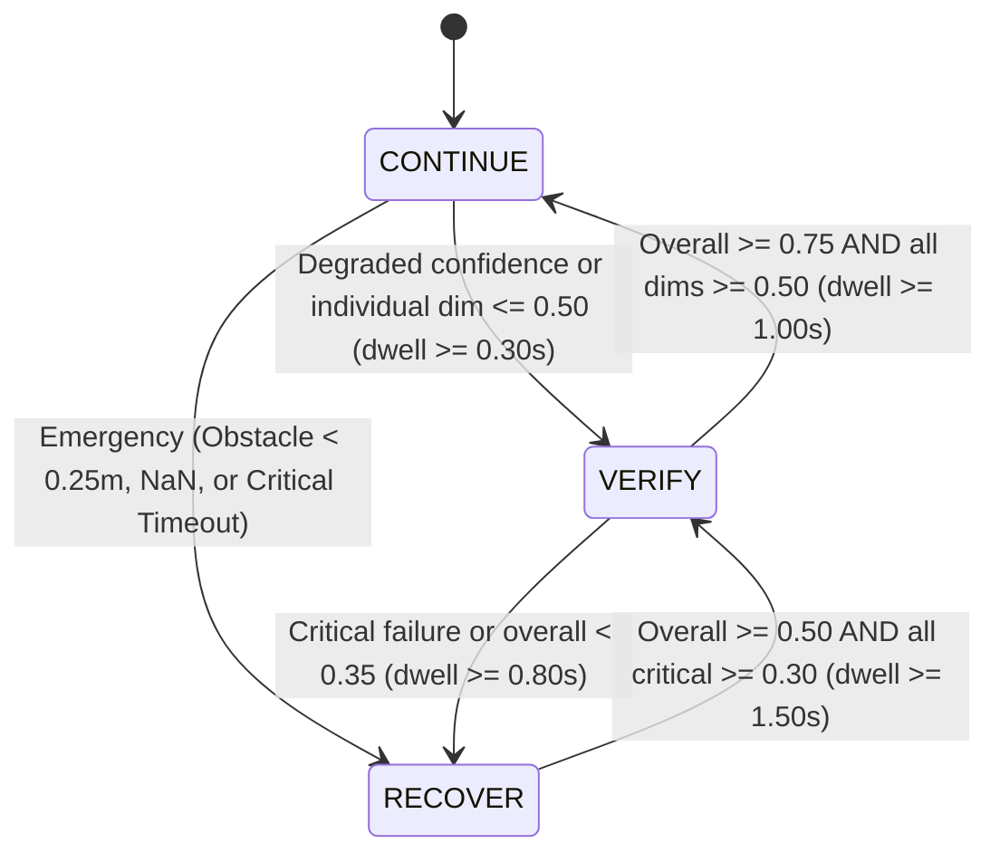

# Phase 7: NAVIGUARD Confidence & Decision Layer

## 1. System Overview & Objective

The **NAVIGUARD Confidence and Autonomous Decision Layer** is the central reasoning engine of the NAVIGUARD autonomous outdoor UGV architecture. Operating downstream of deterministic image perception, geometric visual odometry, multi-sensor temporal synchronization, visual-inertial state estimation (EKF), and graph-based visual SLAM, this package continuously computes a multi-dimensional confidence vector and determines whether the robot should:

1. **`CONTINUE` (0)**: High multi-sensor agreement, healthy SLAM localization, and clear path clearance. Autonomous navigation maneuvers are permitted.
2. **`VERIFY` (1)**: Moderate degradation or sensor discrepancy (e.g. reduced visual feature inliers, slight temporal jitter, or wheel-IMU drift). Robot slows down, initiates sensor cross-checks, and executes a verification dwell.
3. **`RECOVER` (2)**: Severe sensor failure, total visual/SLAM tracking loss, IMU/encoder dropout, or imminent obstacle collision. Robot executes an emergency stop and triggers autonomous recovery protocols (reserved for Phase 8).

---

## 2. Multi-Dimensional Confidence Architecture

Rather than collapsing all sensor information into a single uninterpretable heuristic, NAVIGUARD maintains an 8-dimensional confidence state:

| Dimension | Range | Primary Sensors / Upstream Topics | Core Metric Evaluators |
| :--- | :--- | :--- | :--- |
| **`visual_confidence`** | $[0.0, 1.0]$ | `/visual_odometry/telemetry` | Shi-Tomasi feature inliers ($>35$ nominal, $<15$ failure), RANSAC ratio, essential matrix validity, optical flow dispersion. |
| **`localization_confidence`** | $[0.0, 1.0]$ | `/slam/diagnostics` | SLAM tracking state (`OK`, `DEGRADED`, `TRACKING_LOST`), ORB reprojection error, landmark density, keyframe graph consistency. |
| **`imu_confidence`** | $[0.0, 1.0]$ | `/imu` | Freshness ($<0.5\text{s}$ timeout), acceleration norm bounds ($4.0 \le \|a\| \le 22.0\text{ m/s}^2$), angular rate limits ($\|\omega\| \le 4.0\text{ rad/s}$), NaN/Inf checks. |
| **`wheel_confidence`** | $[0.0, 1.0]$ | `/odom` | Freshness ($<0.5\text{s}$), non-holonomic lateral slip constraint ($\|v_y\| \le 0.25\text{ m/s}$), speed limits, encoder acceleration jump detection. |
| **`temporal_confidence`** | $[0.0, 1.0]$ | `/sensor_sync/diagnostics` | Aggregate sync status (`PASS`, `WARNING`, `FAIL`), Camera-IMU median latency ($<60\text{ ms}$), period jitter. |
| **`cross_sensor_confidence`** | $[0.0, 1.0]$ | `/state_estimation/diagnostics` | Physical consistency flags (VO-wheel, VO-IMU, wheel-IMU), yaw rate residual ($\|r_{\omega_z}\| \le 0.40\text{ rad/s}$), EKF Mahalanobis gating rejections. |
| **`map_confidence`** | $[0.0, 1.0]$ | `/slam/map`, `/slam/pose` | 2D occupancy grid obstacle distance: Critical zone ($<0.35\text{m}$), Caution zone ($0.35\text{--}0.75\text{m}$), Clearance zone ($>0.75\text{m}$). |
| **`overall_confidence`** | $[0.0, 1.0]$ | Composite Engine | Weighted linear combination gated by safety critical floors. |

### Mathematical Formulation of Composite Confidence
$$\mathcal{C}_{\text{weighted}} = \frac{\sum_{i=1}^{7} w_i C_i}{\sum_{i=1}^{7} w_i}$$
where $w = \{0.20, 0.25, 0.15, 0.15, 0.10, 0.10, 0.05\}$.

**Safety Gating Constraints:**
1. **Critical Sensor Floor**: If any safety-critical sensor collapses ($C_{\text{crit}} = \min(C_{\text{imu}}, C_{\text{wheel}}, C_{\text{loc}}, C_{\text{cross}}) < 0.25$):
   $$\mathcal{C}_{\text{overall}} \le \min\left(\mathcal{C}_{\text{weighted}}, \max(C_{\text{crit}} \times 1.5, 0.20)\right)$$
2. **Obstacle Collision Emergency**: If obstacle detected in collision footprint ($C_{\text{map}} < 0.20$):
   $$\mathcal{C}_{\text{overall}} \le 0.15$$
3. **Dual Vision-Localization Loss**: If both visual tracking and SLAM localization fail ($C_{\text{vis}} < 0.20 \land C_{\text{loc}} < 0.30$):
   $$\mathcal{C}_{\text{overall}} \le 0.25$$

---

## 3. Finite State Machine with Hysteresis & Debounce

To prevent rapid oscillation (chattering) between operating modes in noisy outdoor environments, the decision engine enforces deterministic debounce timers and asymmetric hysteresis:

- **Emergency Bypass**: Any catastrophic fault (e.g. NaN/Inf in IMU/Odometry or immediate obstacle impact) triggers `RECOVER` with **0.00s delay**.
- **Return Hysteresis**: Exiting `RECOVER` requires transitioning through `VERIFY` with a 1.5s sustained dwell, followed by a 1.0s dwell before returning to `CONTINUE`.

---

## 4. ROS 2 Interfaces

### Subscriptions
- `/visual_odometry/telemetry` (`diagnostic_msgs/DiagnosticArray`)
- `/sensor_sync/diagnostics` (`diagnostic_msgs/DiagnosticArray`)
- `/state_estimation/diagnostics` (`diagnostic_msgs/DiagnosticArray`)
- `/slam/diagnostics` (`diagnostic_msgs/DiagnosticArray`)
- `/imu` (`sensor_msgs/Imu`, Best-Effort QoS)
- `/odom` (`nav_msgs/Odometry`, Reliable QoS)
- `/slam/map` (`nav_msgs/OccupancyGrid`, Transient-Local QoS)
- `/slam/pose` (`geometry_msgs/PoseWithCovarianceStamped`, Reliable QoS)

### Publishers
- `/naviguard/decision` (`std_msgs/String`): Real-time JSON document detailing state, state code, overall confidence, primary reason, and secondary reasons.
- `/naviguard/diagnostics` (`diagnostic_msgs/DiagnosticArray`): Comprehensive diagnostic tree detailing all 7 dimensions and dwell times.
- `/naviguard/decision_marker` (`visualization_msgs/MarkerArray`):
  - **Halo Marker**: 3D translucent ground disk under the UGV (Green for CONTINUE, Amber for VERIFY, Red for RECOVER).
  - **Text Marker**: Floating 3D billboard with current state, confidence score, and primary reason string.

---

## 5. Verification & Fault Injection Benchmarks

Verified against 9 benchmark scenarios:

| Test Case | Scenario Description | Expected State | Observed State | Result |
| :--- | :--- | :--- | :--- | :--- |
| **Baseline** | Nominal multi-sensor simulation (10.0s) | `CONTINUE` (100%) | `CONTINUE` (100%, 0 False Alarms) | **PASS** |
| **Fault A** | VO degraded inliers ($N=20$) | `VERIFY` | `VERIFY` $\to$ `CONTINUE` after restore | **PASS** |
| **Fault B** | Complete visual/camera blackout | `RECOVER` | `RECOVER` (Reason: `VO_DATA_TIMEOUT`) | **PASS** |
| **Fault C** | IMU stream dropout ($>0.5\text{s}$) | `RECOVER` | `RECOVER` (Reason: `IMU_TIMEOUT`) | **PASS** |
| **Fault D** | IMU NaN anomaly / shock | `RECOVER` (Immediate) | `RECOVER` (Reason: `IMU_NAN_OR_INF`) | **PASS** |
| **Fault E** | Wheel odometry dropout ($>0.5\text{s}$) | `RECOVER` | `RECOVER` (Reason: `WHEEL_ODOM_TIMEOUT`) | **PASS** |
| **Fault F** | Wheel lateral slip ($v_y = 0.45\text{ m/s}$) | `VERIFY` | `VERIFY` (Reason: `WHEEL_LATERAL_SLIP`) | **PASS** |
| **Fault G** | Wheel-IMU cross-sensor divergence | `VERIFY` | `VERIFY` (Reason: `WHEEL_IMU_DISAGREEMENT`) | **PASS** |
| **Fault H** | Obstacle collision hazard ($d=0.20\text{m}$) | `RECOVER` (Immediate) | `RECOVER` (Reason: `OBSTACLE_COLLISION_CRITICAL`) | **PASS** |

Total automated unit & lifecycle tests: **20 passed, 0 failures** in `naviguard_confidence`.
Total workspace automated test suite: **106 passed, 0 failures** across all 7 packages.
