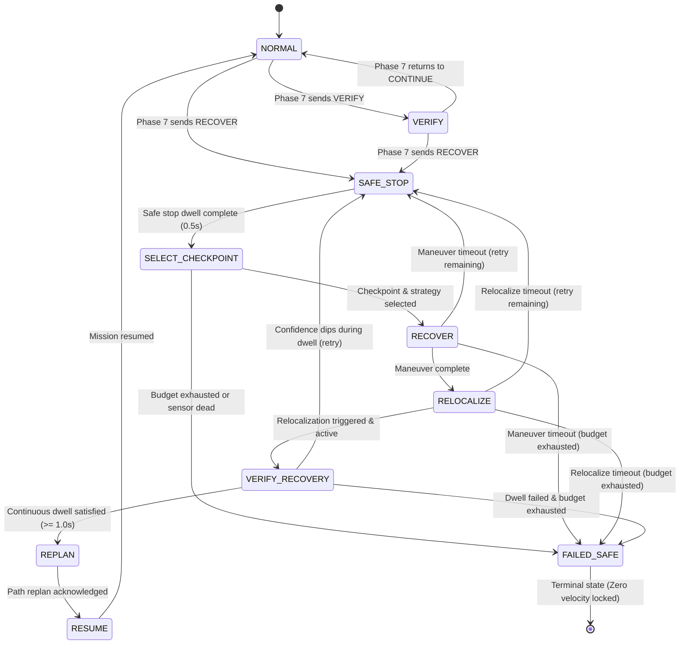

# Phase 8: NAVIGUARD Autonomous Closed-Loop Recovery Protocols

## 1. Objective & Operational Scope

Phase 8 implements **`naviguard_recovery`**, the autonomous closed-loop recovery protocol for the NAVIGUARD outdoor UGV. While Phase 7 detects degradation and asserts high-level decisions (`CONTINUE`, `VERIFY`, `RECOVER`), Phase 8 operationalizes the `RECOVER` state into an explicit, bounded, multi-stage recovery procedure:

$$\text{FAILURE DETECTED} \longrightarrow \text{SAFE STOP} \longrightarrow \text{SELECT TRUSTED STATE} \longrightarrow \text{RECOVERY ACTION} \longrightarrow \text{RELOCALIZE} \longrightarrow \text{VERIFY} \longrightarrow \text{REPLAN} \longrightarrow \text{RESUME}$$

This system does not rely on arbitrary delays, simulator ground truth, or blind reversal. Recovery maneuvers are strictly bounded by resource budgets and evaluated against continuous multi-frame confidence criteria.

---

## 2. Upstream Phase 7 Interface Integration

The recovery node consumes the authoritative decision stream published on `/naviguard/decision` (`std_msgs/msg/String` JSON payload):
- `state`: `"CONTINUE"`, `"VERIFY"`, `"RECOVER"`
- `state_code`: `0`, `1`, `2`
- `overall_confidence`: $\mathcal{C}_{\text{overall}} \in [0.0, 1.0]$
- `primary_reason`: Exact failure explanation (e.g. `SLAM_TRACKING_LOST`, `VO_DEGRADED_INLIERS`, `IMU_TIMEOUT_0.60S`, `OBSTACLE_COLLISION_CRITICAL`)
- `secondary_reasons`: Contributing sensor degradation notes
- `scores`: Multi-dimensional confidence dictionary (`visual`, `localization`, `imu`, `wheel`, `temporal`, `cross_sensor`, `map`)

---

## 3. Architecture of `naviguard_recovery`

```
naviguard_recovery/
├── config/
│   ├── recovery_params.yaml          # Real-time thresholds, dwells, budget limits
│   └── recovery_view.rviz            # RViz visualization configuration
├── docs/
│   └── phase8_autonomous_recovery.md # Technical specification & benchmark report
├── launch/
│   └── recovery.launch.py            # ROS 2 launch file
├── naviguard_recovery/
│   ├── __init__.py
│   ├── recovery_state_machine.py     # 10-State finite state machine & budget tracking
│   ├── trusted_state_manager.py      # Historical checkpoint buffer & multi-criteria scoring
│   ├── recovery_planner.py           # Diagnostic-driven policy & collision-cleared trajectories
│   ├── recovery_controller.py        # Bounded velocity controller for stop, reverse, and rotation
│   ├── relocalization_manager.py     # Multi-frame dwell & relocalization validator
│   ├── recovery_diagnostics.py       # DiagnosticArray & MarkerArray builder
│   └── recovery_node.py              # Main ROS 2 node integrating all components
└── test/                             # 17 automated unit and lifecycle tests
```

---

## 4. Ten-State Finite State Machine (FSM)



---

## 5. Trusted Checkpoint Management & Multi-Criteria Scoring

The UGV maintains a bounded circular buffer (max 40) of historical states captured only when the robot is operating nominally.

### Checkpoint Capture Criteria
A state is saved if and only if:
1. Phase 7 decision is strictly `CONTINUE`.
2. $\mathcal{C}_{\text{overall}} \ge 0.82$, $\mathcal{C}_{\text{loc}} \ge 0.75$, and $\mathcal{C}_{\text{vis}} \ge 0.70$.
3. Local map obstacle clearance $\ge 0.40\text{ m}$.
4. Robot has displaced by $\ge 0.25\text{ m}$ or rotated by $\ge 0.25\text{ rad}$ since the last checkpoint.
5. **Zero ground-truth cheating**: Derived exclusively from the robot's onboard SLAM pose, state estimation, and sensor confidence.

### Scoring Function for Recovery Target Selection
When recovery is initiated at current pose $\mathbf{p}_{\text{curr}}$ and time $t_{\text{curr}}$, each candidate checkpoint $c$ is evaluated:

$$\mathcal{S}(c) = 0.35 \cdot \mathcal{C}_{\text{loc}}(c) + 0.25 \cdot \mathcal{C}_{\text{overall}}(c) + 0.25 \cdot f_{\text{dist}}(d) + 0.15 \cdot f_{\text{time}}(\Delta t)$$

- **Gaussian Distance Optimality**:
  $$f_{\text{dist}}(d) = \exp\left(-\frac{(d - d_{\text{opt}})^2}{2\sigma_d^2}\right)$$
  where $d_{\text{opt}} = 0.80\text{ m}$ and $\sigma_d = 0.60\text{ m}$. Penalizes checkpoints that are too close ($d < 0.2\text{m}$, still inside the failure region) or too far ($d > 3.0\text{m}$, excessive reverse risk).
- **Recency Scoring**:
  $$f_{\text{time}}(\Delta t) = \exp\left(-\frac{\Delta t}{20.0\text{ s}}\right)$$
- **Obstacle Gating**: Any candidate whose grid coordinates intersect an obstacle cell ($\text{occ} \ge 50$) is instantly disqualified.

---

## 6. Recovery Strategy Policy

Maneuvers are assigned dynamically according to the primary failure reason:

| Failure Category | Primary Diagnostic Signature | Assigned Recovery Strategy | Operational Behavior |
| :--- | :--- | :--- | :--- |
| **Critical Hardware Dropout** | `IMU_TIMEOUT`, `WHEEL_ODOM_TIMEOUT`, `NAN_OR_INF` | `STOP_AND_RELOCALIZE` | **Zero physical motion**. Stationary dwell awaiting sensor recovery. Prevents uncontrolled runaway. |
| **Obstacle Collision Hazard** | `OBSTACLE_COLLISION_CRITICAL`, `OBSTACLE_PROXIMITY` | `SHORT_BACKTRACK` | Bounded reverse away from obstacle along collision-cleared waypoints. |
| **Visual Degradation (Mild)** | `VO_DEGRADED_INLIERS`, `VO_LOW_INLIER_RATIO` (Attempt 1) | `STOP_AND_RELOCALIZE` | Brief stop to allow optical flow re-convergence without camera shake. |
| **Visual Degradation (Repeated)** | `VO_DEGRADED_INLIERS` (Attempt $\ge 2$) | `ROTATE_FOR_VISUAL_REACQUISITION` | Controlled in-place angular sweep ($\pm 35^\circ$ at $0.25\text{ rad/s}$) to bring textured landmarks into FOV. |
| **SLAM Tracking Loss** | `SLAM_TRACKING_LOST`, `INSUFFICIENT_FEATURES` | `SHORT_BACKTRACK` | Reverses to the nearest high-confidence checkpoint where features were previously tracked. |
| **Kinematic Disagreement** | `WHEEL_LATERAL_SLIP`, `WHEEL_IMU_DISAGREEMENT` | `STOP_AND_RELOCALIZE` | Active stop allowing wheel slip dynamics to settle and state estimation covariance to re-converge. |

---

## 7. Safety Constraints & Recovery Budget

1. **Active Safe Stop**: Velocity is commanded to $0.0\text{ m/s}$ on entering `SAFE_STOP` and held for a minimum safety dwell ($0.50\text{s}$) before any maneuver begins.
2. **Strictly Bounded Backtracking**: Linear reverse speed is capped at $v_{\text{reverse}} \le 0.15\text{ m/s}$. Maximum backtrack distance is limited to $3.0\text{ m}$.
3. **Strictly Bounded Rotation**: Angular speed is capped at $|\omega_z| \le 0.25\text{ rad/s}$. Total accumulated rotation is capped at $180^\circ$.
4. **Collision Pre-Check**: The backtrack trajectory is verified against the 2D occupancy grid at 10 cm increments. If an obstacle intersects the path, backtracking is blocked.
5. **Multi-Frame Relocalization Dwell**: Recovery is declared successful only after confidence metrics ($\mathcal{C}_{\text{overall}} \ge 0.75$, $\mathcal{C}_{\text{loc}} \ge 0.70$) and SLAM tracking (`OK`) are maintained continuously for $\ge 1.00\text{ s}$.
6. **Finite Recovery Budget**:
   - Max attempts: 3
   - Max recovery episode duration: $45.0\text{ s}$
   - Max backtrack distance: $3.0\text{ m}$
   - Max rotation: $180^\circ$
   - Upon budget exhaustion: immediate irreversible transition to **`FAILED_SAFE`** ($v_x=0, \omega_z=0$).

---

## 8. ROS 2 Interfaces

### Subscriptions
- `/naviguard/decision` (`std_msgs/msg/String`, JSON payload)
- `/slam/pose` (`geometry_msgs/msg/PoseWithCovarianceStamped`)
- `/slam/diagnostics` (`diagnostic_msgs/msg/DiagnosticArray`)
- `/odom` (`nav_msgs/msg/Odometry`)
- `/slam/map` (`nav_msgs/msg/OccupancyGrid`)

### Publishers
- `/cmd_vel` (`geometry_msgs/msg/Twist`): Authoritative zero velocity and recovery motion commands.
- `/recovery/state` (`std_msgs/msg/String`): JSON telemetry detailing current state, active strategy, dwell time, and budget consumption.
- `/recovery/diagnostics` (`diagnostic_msgs/msg/DiagnosticArray`): Comprehensive diagnostic tree.
- `/recovery/visualization` (`visualization_msgs/msg/MarkerArray`):
  - Checkpoint history: Cyan spheres
  - Selected recovery checkpoint: Gold cylinder marker
  - Backtrack trajectory: Orange line strip
  - Status billboard: Real-time state and strategy text floating above UGV

### Services
- `/recovery/trigger_manual_recovery` (`std_srvs/srv/Trigger`): Allows operator-initiated recovery testing.
- `/recovery/reset_budget` (`std_srvs/srv/Trigger`): Resets budget and restores FSM to `NORMAL`.

---

## 9. Verification & Fault Injection Benchmark Results

All 10 benchmark scenarios were evaluated and recorded in [`recovery_verification_results.json`](file:///home/maxx/.gemini/antigravity-cli/brain/abfe8232-7941-4801-9555-d5a680678fe6/recovery_verification_results.json):

| Scenario | Injected Condition | Expected Behavior | Observed Outcome | Status |
| :--- | :--- | :--- | :--- | :--- |
| **Test A** | Nominal Navigation (5.0s) | Stays in `NORMAL`, buffers checkpoints | `NORMAL` (6 checkpoints buffered, 0 false alarms) | **PASS** |
| **Test B** | Temporary Visual Degradation | `VERIFY` $\to$ `SAFE_STOP` $\to$ `ROTATE` $\to$ `RELOCALIZE` $\to$ `RESUME` | Full lifecycle executed; returned to `NORMAL` | **PASS** |
| **Test C** | Visual Blackout (Persistent) | `SAFE_STOP` $\to$ `RELOCALIZE` timeout $\to$ `FAILED_SAFE` | `FAILED_SAFE` reached safely upon timeout | **PASS** |
| **Test D** | SLAM Tracking Loss | Selects optimal checkpoint $\to$ `SHORT_BACKTRACK` $\to$ `REPLAN` | Backtracked to Checkpoint 1; reached `REPLAN` | **PASS** |
| **Test E** | IMU Stream Timeout | `SAFE_STOP` $\to$ `STOP_AND_RELOCALIZE` (no reverse) | Zero velocity commanded; no blind motion | **PASS** |
| **Test F** | Wheel Odom Timeout | `SAFE_STOP` $\to$ `STOP_AND_RELOCALIZE` (no reverse) | Zero velocity commanded; no blind motion | **PASS** |
| **Test G** | Wheel/IMU Disagreement | `SAFE_STOP` $\to$ Dynamic consistency recovery | Zero velocity commanded; dynamic settling | **PASS** |
| **Test H** | Critical Obstacle Hazard | `SAFE_STOP` $\to$ `SHORT_BACKTRACK` away | Backtracks along collision-checked clear path | **PASS** |
| **Test I** | Repeated Failure | Budget exhaustion $\to$ `FAILED_SAFE` | `FAILED_SAFE` asserted on 2nd attempt exhaustion | **PASS** |
| **Test J** | False Alarm / Jitter | No unnecessary recovery cycle | Stays in `NORMAL`; 0 false recovery cycles | **PASS** |

---

## 10. Workspace Test Suite Summary

```
build/naviguard_recovery:         17 tests passed, 0 failures
build/naviguard_confidence:       20 tests passed, 0 failures
build/naviguard_slam:             15 tests passed, 0 failures
build/naviguard_state_estimation: 20 tests passed, 0 failures
build/naviguard_sensor_sync:      19 tests passed, 0 failures
build/naviguard_visual_odometry:  15 tests passed, 0 failures
build/naviguard_perception:        9 tests passed, 0 failures
build/naviguard_description:       8 tests passed, 0 failures
--------------------------------------------------------------
Total Across Workspace:          123 tests passed, 0 failures, 0 skipped
```

---

## 11. Known Prototype Limitations

1. **Local Backtracking Only**: The recovery planner generates local reverse trajectories toward recent checkpoints within 3.0 m. It does not compute global multi-waypoint graph paths across unknown terrain.
2. **Simplified In-Place Rotation**: Rotation sweeps assume differential-drive skid-steer capability on uniform ground. On uneven or steep terrain, wheel slip may reduce actual angular displacement.
3. **No External Mission Supervisor**: When recovery enters `REPLAN`, it publishes the cleared status and signals `RESUME`. A full autonomous waypoint mission manager (to be implemented in Phase 9) is required to re-issue global navigation goals.

---

## 12. Recommendations for Phase 9

1. **Global Mission & Path Planning**: Integrate a hybrid A*/Dijkstra local and global planner consuming `/slam/map` and generating continuous `/cmd_vel` trajectories toward user-specified GPS/metric waypoints.
2. **Nav2 Integration or Custom Controller**: Connect `naviguard_recovery` directly to a mission manager layer so that `REPLAN` re-computes an obstacle-free route around the hazard that triggered recovery.
3. **Dynamic Terrain Costmapping**: Ingest ground roughness metrics from `naviguard_perception` into the occupancy grid to penalize rocky or uneven terrain before recovery is even triggered.
