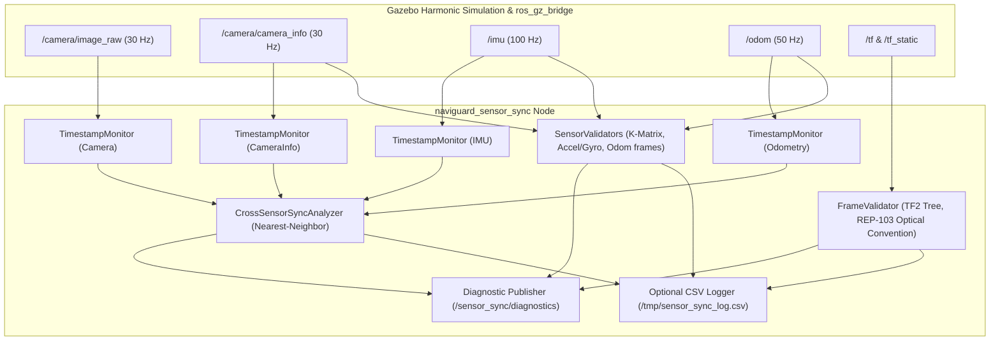

# Phase 5A: Sensor Synchronization and Frame Calibration Layer

## Overview & Scope

The `naviguard_sensor_sync` package establishes the temporal, intrinsic, and extrinsic frame calibration verification foundation for the NAVIGUARD autonomous unmanned ground vehicle (UGV).

> **CRITICAL ARCHITECTURAL BOUNDARY:**
> Phase 5A establishes temporal and frame correctness. It does **NOT** perform sensor fusion, does **NOT** establish metric visual odometry, and does **NOT** implement SLAM or autonomous recovery.

---

## 1. System Architecture



---

## 2. Terminology & Separation of Concerns

To prevent ambiguity, Phase 5A strictly distinguishes:
1. **Intrinsic Calibration**: Mathematical mapping from 3D camera coordinates to 2D image coordinates ($f_x, f_y, c_x, c_y$, distortion model). Verified from `/camera/camera_info`.
2. **Extrinsic Calibration**: Spatial rigid-body $SE(3)$ transformation ($R, \mathbf{t}$) between physical sensor links (`camera_link`, `camera_optical_link`, `imu_link`) and the mobile robot chassis (`base_link`). Verified via the ROS 2 TF tree.
3. **Temporal Synchronization**: Cross-sensor time offset ($|t_A - t_B|$) between discrete measurement capture events. **Temporal synchronization is NOT calibration**.

---

## 3. Frame Hierarchy & Optical Frame Convention

### Expected Tree Structure:
* `odom` $\to$ `base_link` (Dynamic odometry transform published by Gazebo diff-drive plugin)
* `base_link` $\to$ `base_footprint` (Ground contact projection, $z = -0.12$ m)
* `base_link` $\to$ `camera_link` (Physical chassis mount, $x = +0.22, z = +0.14$ m)
* `camera_link` $\to$ `camera_optical_link` (Standard ROS optical frame)
* `base_link` $\to$ `imu_link` (Internal IMU mount, $z = +0.02$ m)
* `base_link` $\to$ wheel frames (`left_front_wheel`, `right_front_wheel`, `left_rear_wheel`, `right_rear_wheel`)

### Optical Frame Convention (REP-103):
In standard ROS optical conventions:
* Optical $+Z$ (forward along viewing axis) $\to$ Chassis $+X$
* Optical $+X$ (right across image) $\to$ Chassis $-Y$
* Optical $+Y$ (down across image) $\to$ Chassis $-Z$

The validator dynamically verifies the rotation matrix $R_{optical}$ satisfies:
$$R_{optical} \cdot \begin{bmatrix} 0 \\ 0 \\ 1 \end{bmatrix} = \begin{bmatrix} 1 \\ 0 \\ 0 \end{bmatrix}, \quad R_{optical} \cdot \begin{bmatrix} 1 \\ 0 \\ 0 \end{bmatrix} = \begin{bmatrix} 0 \\ -1 \\ 0 \end{bmatrix}, \quad R_{optical} \cdot \begin{bmatrix} 0 \\ 1 \\ 0 \end{bmatrix} = \begin{bmatrix} 0 \\ 0 \\ -1 \end{bmatrix}$$

---

## 4. Cross-Sensor Synchronization Analysis

The node maintains sliding timestamp histories ($N=100$) for each sensor. For each camera frame $t_{cam}$, a binary search locates the nearest-neighbor measurement $t_{target}$ in target streams:
$$\Delta t = |t_{cam} - t_{target}|$$

### Calculated Metrics:
* Mean absolute delta: $\Delta t_{mean}$
* Median absolute delta: $\Delta t_{median}$
* Maximum absolute delta: $\Delta t_{max}$
* Percentage within configurable tolerance $\tau_{sync}$ (default $20.0$ ms)

### Status Classification:
* **PASS**: $\ge 85\%$ of samples within $\tau_{sync}$ and $\Delta t_{median} \le \tau_{sync}$.
* **WARNING**: $50\% \le \text{within} < 85\%$.
* **FAIL**: $< 50\%$ within tolerance or severe timestamp non-monotonicity.

---

## 5. Topics and Interfaces

### Subscriptions:
* `/camera/image_raw` (`sensor_msgs/msg/Image`): Best-Effort QoS
* `/camera/camera_info` (`sensor_msgs/msg/CameraInfo`): Best-Effort QoS
* `/imu` (`sensor_msgs/msg/Imu`): Best-Effort QoS
* `/odom` (`nav_msgs/msg/Odometry`): Reliable QoS

### Publications:
* `/sensor_sync/diagnostics` (`diagnostic_msgs/msg/DiagnosticArray`): Diagnostic telemetry reporting rates, periods, synchronization deltas, frame validation, and overall status (`PASS`, `WARNING`, `FAIL`).

---

## 6. Launch & Verification Commands

### Build:
```bash
colcon build --symlink-install --packages-select naviguard_sensor_sync
```

### Run Unit Tests:
```bash
pytest -v src/naviguard_sensor_sync/test
```

### Launch Standalone:
```bash
ros2 launch naviguard_sensor_sync sensor_sync.launch.py use_sim_time:=true
```

---

## 7. Known Limitations

1. **Simulation Monotonicity**: Under Gazebo Harmonic simulation paused states or clock resets, timestamps pause with simulation clock.
2. **Raw 6-Axis IMU Orientation**: In standard simulated IMUs without an internal onboard AHRS algorithm, orientation field is unset or unavailable. Phase 5A explicitly detects and flags this as `UNAVAILABLE` rather than fabricating synthetic orientation.
